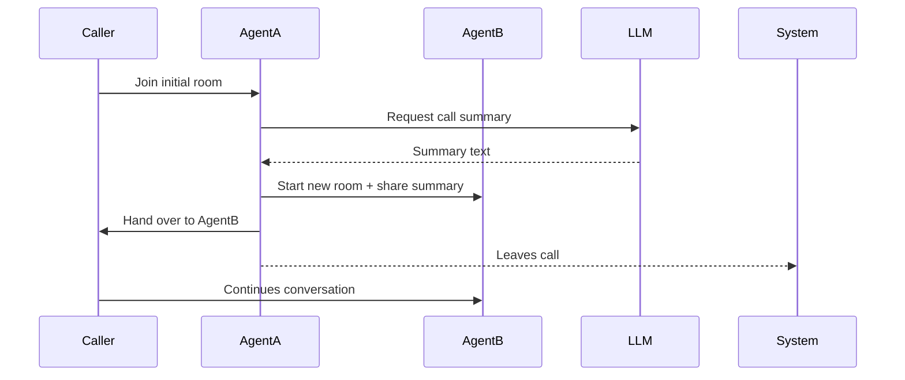

# Warm Call Transfer Demo with LiveKit and LLMs

## Overview

This project demonstrates a **warm call transfer** workflow using **LiveKit** for real-time audio communication with deepgram sst and an **LLM** (gimini) for generating call summaries.

**Flow:**

1. Caller connects with **Agent A** in a LiveKit room.
2. Agent A initiates a **warm transfer** to **Agent B**.
3. A new LiveKit room is created for Agent B and the caller.
4. Agent A shares the **call summary** generated by an LLM.
5. Agent A exits the call, leaving Agent B and the caller connected.

## Known Issues

- **Gemini API Overload (503)**: At times, the Gemini API may return

OTHER WISE IT WILL WORK FINE

```
{'error': {'code': 503, 'message': 'The model is overloaded. Please try again later.', 'status': 'UNAVAILABLE'}}
```

In such cases, summary generation may fail.
**Workaround:**

- Retry after some time.
- Or configure the project to use another LLM provider like **OpenAI**

## Features

- Real-time audio/video call using **LiveKit**.
- LLM-based call summary generation for seamless context transfer.
- Warm transfer between agents with independent LiveKit rooms.
- Interactive **Next.js frontend** for connecting and managing calls.

## 🎥 Demo

You can watch the demo here:

- [demo.mkv](./demo.mkv) (included in repo)

## Tech Stack

- **Backend:** Python + FastAPI + LiveKit Server SDK + deepgram
- **Frontend:** Next.js 13+ (App Router) + TypeScript + Zustand

## Setup Instructions

### 1. Clone the repository

```bash
git clone <repo-url>
cd ac-warm-transfer/backend
```

### 2. Install Python dependencies

```bash
python -m venv venv
source venv/bin/activate   # Windows: .\venv\Scripts\activate
pip install -r requirements.txt
```

### 3. Configure environment variables

Create `.env`:

```env
LIVEKIT_URL=<your_livekit_url>
LIVEKIT_API_KEY=<your_livekit_api_key>
LIVEKIT_API_SECRET=<your_livekit_api_secret>

OPENAI_API_KEY=<your_openai_api_key>

GEMINI_API_KEY=<optional_for_llm>
```

### 4. Run the backend

```bash
uvicorn app.main:app --reload
```

Endpoints:

- `POST /api/start-call` → Start a call with Agent A.
- `POST /api/transfer` → Initiate warm transfer to Agent B.
- `POST /api/token` → Issue JWT token for joining rooms.

### 5. Run the frontend

```
NEXT_PUBLIC_LIVEKIT_URL=
DEEPGRAM_API_KEY=
```

```bash
cd ../frontend
pnpm install
pnpm run dev
```

## Repository Structure

```
ac-warm-transfer/
├── backend/        # FastAPI backend
│   ├── app/
│   │   ├── api/       # Routes
│   │   ├── schemas/   # Pydantic models
│   │   ├── services/  # Business logic
│   │   └── main.py
│   └── requirements.txt
└── frontend/      # Next.js + TypeScript + Zustand
    ├── app/          # Pages (App Router)
    ├── components/   # UI components
    └── store/        # Zustand state
```

## Warm Transfer Flow (Diagram)



## Notes

- Ensure **LiveKit server** is running and reachable.
- LLM API key required for call summaries.

## References

- [LiveKit Documentation](https://docs.livekit.io/)
- [OpenAI API](https://platform.openai.com/)
